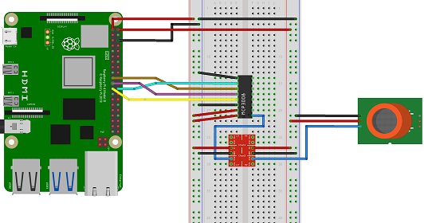

# Alternative-Prüfung-Softwareentwicklung

| Parameter                | Informationen                                                                                                                                                                          |
| ------------------------ | ------------------------------------------------------------------------------------------------------------------------------------------------------------------------------------------ |
| **Veranstaltung**       | Projekt Softwareentwicklung                                                                                                                                                           |
| **Semester**               |   Sommersemester 2022                                                                                                                                                                                        |
| **Hochschule**          | Technische Universität Bergakademie Freiberg                                                                                                                                                      
| **Autoren**              | Lion Waurich (65695) / Caio Marcas Menz (66654)                            

---------------------------------------------------------------------------------
# Chronologie 
 * [Installieren des Raspberry Pi Os](https://github.com/Lion127/Softwareentwicklungsprojekt-2022/blob/main/00Raspberry%20Pi.md#installieren-des-raspberry-pi-os)
 * [Remote Access auf den Raspberry Pi](https://github.com/Lion127/Softwareentwicklungsprojekt-2022/blob/main/00Raspberry%20Pi.md#remote-accsess-auf-den-raspberry-pi)
 * [C-Sharp auf dem Raspberry Pi](https://github.com/Lion127/Softwareentwicklungsprojekt-2022/blob/main/00Raspberry%20Pi.md#C-Sharp-auf-dem-Raspberry-Pi)
 * [.Net auf dem Raspberry Pi Installieren und Visual Studio nutzen](https://github.com/Lion127/Softwareentwicklungsprojekt-2022/blob/main/00Raspberry%20Pi.md#net-auf-dem-raspberry-pi-installieren-und-visual-studio-nutzen)
 * [Ansteuern der Sensoren](https://github.com/Lion127/Softwareentwicklungsprojekt-2022/blob/main/00Raspberry%20Pi.md#Ansteuern-der-Sensoren)
    * [AM2302](https://github.com/Lion127/Softwareentwicklungsprojekt-2022/blob/main/00Raspberry%20Pi.md#am2302)
    * [Nutzung des MQ-135 mithilfe des MCP3008 und Pegelwandlers](https://github.com/Lion127/Softwareentwicklungsprojekt-2022/blob/main/00Raspberry%20Pi.md#nutzung-des-mq135-mithilfe-des-mcp3008-und-pgelwandlers)
    * [Piezo Buzzer und RGB-LED](https://github.com/Lion127/Softwareentwicklungsprojekt-2022/blob/main/00Raspberry%20Pi.md#piezo-buzzer-und-rgb-led)
    * [20x4 LCD Display](https://github.com/Lion127/Softwareentwicklungsprojekt-2022/blob/main/00Raspberry%20Pi.md#20x4-lcd-display)

# Installieren des Raspberry PI Os 

* Die Micro SD-Karte mittels Raspberry Pi Imager beschreiben 
* Bei der Konfiguration sollte der SSH zugang aktiviert, die WLAN Einstellungen und Benutzername/Passwort gewählt werden
> **Achtung** Falls der SSH zugang nicht aktiviert wurde muss eine Datei mit dem Namen "SSH" im "boot" Ordner hinzugefügt werden
* Nach der Installation des OS den Raspberry Starten 
> Falls das WLAN nicht Konfiguriert wurde, muss der Raspberry Pi über ein LAN Kabel mit dem Router verbunden werden
* Die IP-Adresse des Raspberry Pi finden wir in den Router Einstellungen/Informationen unseres Providers 
* Die IPv4-Adresse des Raspberry Pi stellen wir auf statisch
> Man kann auch selber eine IPv4 wählen und sie dem Raspberry zuteilen. Die Einstellung auf Dynamisch lassen ist möglich, jedoch wird davon abgeraten, da die IP des Raspberry pi dann immer neu ermittelt werden muss


# Remote Accsess auf den Raspberry Pi 

* Auf dem Rechner, mit dem wir den Raspberry Ansteuern wollen, müssen wir das Programm "Putty" Installieren
* Die ermittelte IPv4 geben wir als Host Name ein und gelangen so auf die Bash des Raspberry Pi via Secure Shell (SSH) 
> Secure Shell ist ein Netzwerkprotokoll, welches eine möglichkeit gibt, über ein ungesichertes Netzwerk gesichert auf einen Rechner zuzugreifen
* Dort Melden wir uns mit dem Benutzernamen und Passwort an, welches wir zuvor konfiguriert haben
> Standartpasswort/Benutzername falls die Konfiguration vorher nicht vorgenommen wurde : Benutzername = pi Passwort = raspberry
* Dann muss das "Raspberry Pi Software Configuration Tool" aufgerufen werden
```
sudo raspi-config
```
* Der "sudo" Befehl ist wichtig, da der Benutzer "pi" nicht genügend Berechtigungen besitzt. 
> Man kann auch eine gesamte Session als root user nutzen mit dem "su" Befehl (aber nur eine Session, nicht dauerhaft) 
* Im Raspberry Pi Software Configuration Tool nehmen wir dann folgende änderungen vor
  * Aktivieren VNC-Server (virtual Network Computing) 
  * stellen VNC Resolution auf 1920x1080
  * dann starten wir den Raspberry neu
```
sudo root 
```
* Auf dem Rechner, über den wir auf den Raspberry zugreifen wollen laden wir uns "real VNC viewer" runter und Installieren das Programmm
* wenn alle Konfigurationen stimmen und der Raspberry den VNC-Server gestartet hat, können wir die IPv4 Adresse als Host bei "real VNC viewer" eingeben und nach eingabe des Benutzers und des dazugehörigen Passwortes gelangen wir auf die Grafische oberfläsche des Raspberry Pi 
* damit wir später die Sensoren und GPIOs ansteuern können müssen wir weitere Konfigurationen im "raspi-config" Menü vornehmen
* wir wechseln in der Raspberry Pi Configuration auf die Interfaces und aktivieren folgendes
    * SPI (Serial Peripheral Interface)
    * Serial Port (serielle Schnittstelle, bei denen einzelne Bits zeitgleich nacheinander übertragen werden) 
    * serial Console 
    * 1-Wire (Eindraht-Bus, Die Busteilnehmer werden durch Master gesteuert. Slaves sind mit individuellen Adressen ab Werk ausgestattet und fertig kalibriert)
    * Remote GPIO (Das erlaubt den Remot zugriff auf die Raspberry Pi GPIOs)

# C-Sharp auf dem Raspberry Pi

Das Raspberry Pi OS ist ein Linux basiertes System und .Net ein windows Framework. .Net nutzt man zum entwickeln und Ausführen von C# Programmen. Über Visual Studio ist es schnell und einfach Programme zu entwickeln, kompilieren und auszuführen. Leider ist es nicht ohne probleme möglich C-Sharp Programme auf dem Raspberry Pi auszuführen. Man könnte das Programm auf einen Stick Laden und mit dem Bytecode-Interpreter "MONO" auf dem Raspberry ausführen. Dies ist aber ein sehr aufwendiger vorgang, denn man müsste bei Fehlern das Programm immer wieder neu auf den stick laden und auf dem Raspberry ausführen. Oder man nutzt das Windows IOT Tool. Dies ist aber auch nicht zu empfehlen, weil man damit das Raspberry Pi Os ersetzten müsste. Der Raspberry läuft am besten mit dem Hauseigenen Linux System. Viele Tools wären beim Windows IOT nicht mit dabei und Bugs treten vermehrt auf. Deswegen haben wir uns dafür Entschieden, ".Net" auf dem Raspberry Pi zu installieren und damit gehen wir diesen Problemen aus dem Weg. ".Net" kann man nicht in den Erweiterungen des Raspberry Pi finden, jedoch lässt es sich über die Bash installieren. Der Aufwand ist einmalig zwar höher, erleichtert die spätere Entwicklung des Programms jedoch enorm.


# .Net auf dem Raspberry Pi Installieren und Visual Studio nutzen

* Dieser Befehl wird über Putty auf der Bash eingegeben und Installiert .Net 6 auf dem Raspberry Pi

```
wget -O - https://raw.githubusercontent.com/pjgpetecodes/dotnet5pi/master/install.sh | sudo bash
```
* Danach muss der Raspberry Pi wieder neu gestartet werden bzw REBOOT

```
sudo reboot
```
* Jetzt müssen wir visual Studio auch über Remote-SSH mit dem Raspberry verbinden. Dazu gehen wir auf Visual Studio und Installieren die "Remote-SSH" Erweiterung 
```
ms-vscode-remote.remote-ssh
```
* Als hostname tragen wir **Pi@-IP-Adress-** ein und Visual Studio verbindet sich mit dem Raspberry Pi 
* Auf dem Raspberry Pi erstellen wir einen Ordner, den wir dann über Visual Studio aufrufen können. Das weitere vorgehen ist wie gewohnt. eine C# Datei kann man jetzt erstellen und bearbeiten. Wie man sieht bleibt auch der Befehl gleich. 
```
dotnet new console
```
* Programme sind auf dem Raaspberry jetzt zwar kompilierbar, jedoch bleibt der zugriff auf die GPIOS verwehrt. Deswegen müssen wir ein weiteres Packet hinzufügen, welches wir in den Ordner mit dem Programm speichern. Die Befehle können jetzt über die Bash (via Putty), den VNC-viewer oder Visual Studio eingegeben werden.

```
dotnet add package System.Device.Gpio
```
* Damit wir die Peripherie nutzen können müssen wir in den selben Ordner noch ein weiteres Packet hinterlegen. Dieses Packet würde eigentlich aussreichen um auf die GPIOs direkt zuzugreifen, jedoch gab es dabei öfter Probleme, weshalb wir "System.Device.Gpio" seperat hinterlegt hatten.

```
dotnet add package Iot.Device.Bindings --version 2.1.0-* 
```

# Ansteuern der Sensoren 
.png)

* Das folgende Bild soll den Gesamtaufbau als Steckplan zeigen. Die Verbindungen zum LCD Display dienen nur der Darstellung, da Fritzing kein 20x4 I2C LCD Display zur auswahl hatte. Die Pins entsprechen so der Belegung des PCF8574 Remote 8-Bit I/O Expander.


* Sensormodelle
   * `MQ-135` (Luftqualitätssensor: Benzol, Alkohol, Rauch)
   * `AM2302` (Temperatur und Luftfeuchtigkeit)
 
* Weitere Komponenten
   * `20x4 LCD Display`
   * `Pegelwandler` (3,3V-5V)
   * `MCP3008` (Analog Digital Wandler)
   * `RGB-LED`
   * `Piezo Buzzer`
   * Steckboard
   * Jumper Kabel


## AM2302 

* Der ASM2302 basiert auf der Basis des DHT22 und misst die Luftfeuchtigkeit und die Temperatur. Ausgegeben werden diese werte digital über einen Datenpin


* Mit dem Folgenden C# Code werden die Sensordaten ausgelesen. Das Programm snippet wird dann in das Main Programm Implementiert


```csharp                                      Usage
using System;
using Iot.Device.DHTxx;

using (Dht22 dht = new Dht22(4))

while(true)
{   
    Console.WriteLine($"{dht.Humidity}°C");
    Console.WriteLine($"{dht.Temperature}%");
    Thread.Sleep(1000);
}
```

## Nutzung des MQ135 mithilfe des MCP3008 und Pgelwandlers

* Der MQ135 ist ein Luftqualitätssensor, welcher die Daten als Analoges Signal ausgibt. Der Digitale ausgang gibt nur an, ob die Luftqualität "Gut" oder "schlecht" ist. Den Genauen Wert muss man Analog auslesen. Das Problem dabei ist, dass der Raspberry Pi keine internen ADC (Analog Digital Konverter) besitzt. Aus diesem Grund nutzen wir den MCP3008 als ADC, wodurch wir das Analoge Signal umwandeln und die genauen Daten nutzen können. Des Weiteren arbeitet der MQ135 mit 5V, die GPIOs des Raspberry Pi arbeiten jedoch mit 3,3V. Damit der Raspberry Pi nicht beschädigt wird nutzen wir einen Pegelwandler, welcher die 5V Eingangsspannung in 3,3V umwandelt.


* Die Folgende Grafik zeigt den Steckplan der drei Komponenten. Leider hatten wir bei "Fritzing" (Software für den grafischen Aufbau von Schaltplänen und Steckplänen) nur den MQ-2 Gas Sensor zur verfügung. Da die Anschlüsse der Sensoren jedoch die Selben sind, nutzen wir diesen Sensor zur veranschaulichung. 




* Zu beginn betrachten wir den Pegelwandler. Dieser wird benötigt, da die Gpios des Raspberry Pi nur 3,3V vertragen und die Spannung des MQ135 5V beträgt. Der Bidirektionale Pegelumwandler besitzt interne Pullup wiederstände, welche dafür sorgen, dass bei 5V Eingangsspannung 3,3V als Maximalspannung am Ausgang anliegen.
* Ausgang 
     * LV = 3,3V (Low Voltage)
     * GND 
     * LV 3 = Anschluss des MCP3008 Analog Eingang CH0
 
* Eingang
     * HV = 5V (High Voltage)
     * Gnd 
     * Analog Eingang des Signals aus dem MQ-135
  
  
  
* Da nun am MCP3008 Analog Digitalwandler 3,3V anliegen, können wir diese Information verarbeiten. Der MCP3008 ist ein 10 Bit ADC und hat damit eine auflösung von 0-1023. Die Informationen werden als Byts mittels Bus an die Gpios übermittelt. Dabei gibt es zwei Möglichkeiten. Einmal einen I2C Bus oder den SPI (Serial Peripheral Interface) Bus. Der MCP3008 besitzt keinen I2C Bus, weshalb wir den SPI Bus nutzen müssen. SPI arbeitet nach dem "Master-Slave Prinzip", wodurch Digitale Schaltungen wie unser Aufbau miteinander verbunden werden können. 
* Die Leitungen sehen wie Folgt aus
   * CLK  (Serial Clock ausgehend vom Crontroller zur Synchronisation)
   * MISO (Master Input, Slave Output)
   * MOSI (Master Output, Slave Input)
   * CS   (Chip select)
* Die Bezeichnungen auf den Sensoren können heute varrieren, weil viele Hersteller den "Master-Slave" namen nicht verwenden wollen. So können Beispielsweise SDI/SDO (Serial Data in/Serial Data Out) oder D_in/D_out (Data in/Data out) vorkommen. Die Arbeitsweise bleibt jedoch gleich. 


* Verlötet wurde der MCP3008 ADC von uns und dann wie auf dem Steckplan angeschlossen. Der CH0 Anschluss des MCP3008 wurde mit dem LV3 des Pegelwandlers verbunden und der A0 Output des MQ-135 mit HV3 des Pegelwandlers. Jetzt konnten wir über den SPI-Bus die Analogen Daten des MQ-135 Auslesen.
* Da die Daten über den ADC umgewandelt werden sprechen wir nicht den MQ-135 an, sondern den MCP3008. Folgendes Programm liest die Daten aus:

```csharp                                      Usage
using System;
using System.Device.Spi;
using System.Threading;
using Iot.Device.Adc;


var hardwareSpiSettings = new SpiConnectionSettings(0,0);

using var spi = SpiDevice.Create(hardwareSpiSettings);
using (Mcp3008 mcp = new Mcp3008(spi))
{
     while (true)
     {
         double value = mcp.Read(0);
         value = value/ 10.24;
         value = Math.Round(value,2);
         Console.WriteLine($"{value} %");
         Thread.Sleep(500);
     }
}
```

## Piezo Buzzer und RGB-LED

* Wir haben diese Komponenten in einer Beschreibung Organisiert, weil es ein einfaches Toggeln der GPIO-Ausgänge ist. Als erstes muss der GPIO als Ausgang definiert werden, dann werden die Komponenten Angeschlossen. Dann kann man ein "High" Signal/Flag dem jeweiligen Pin Sendet und dieser Pegelt von 0 auf 1 und sendet die 3,3V Ausgangsspannung. 


* Die Komponenten sind zwar nicht die gleichen, jedoch sind die Anschlüsse gleich. Der Piezo Buzzer ist an 3,3V und GND angeschlossen, wenn GPIO(27) auf High gesetzt wird erzeugt er einen Ton. Wenn GPIO(27) auf Low gesetzt ist, dann bleibt der Buzzer aus. Bei der RGB-LED ist es anders, dort ist GPIO(22) mit Rot verbunden und GPIO(23) mit Grün. Aktiviert man GPIO(22) so leuchtet die LED Rot, aktiviert man GPIO(23) leuchtet sie Grün. Aktiviert man beide zusammen leuchtet die LED Gelb. so kann man die RGB-LED in verschiedenen Farben leuchten lassen.

* Dies ist der Programm snippet, welches die RGB-LED Gelb Leuchten lässt. Wenn man nur einen GPIO aktivieren würde, dann würde die LED grün oder rot leuchten
```csharp                                      Usage
using System;
using System.Device.Gpio;
using System.Threading;

Console.WriteLine("Blinken");
int Rot = 22;
int Grün = 23;
using var controller = new GpioController();
controller.OpenPin(Rot, PinMode.Output);
controller.OpenPin(Grün, PinMode.Output);
while (true)
{
    controller.Write(Rot, PinValue.High);
    controller.Write(Grün, PinValue.High);
    Thread.Sleep(1000);
   
}
```

* Hier wird ein Warn Signal durch Aktivieren und Deaktivieren des Buzzers(GPIO(27)) erzeugt
```csharp                                      Usage
using System;
using System.Device.Gpio;
using System.Threading;

int pin = 27;
using var controller = new GpioController();
controller.OpenPin(pin, PinMode.Output);
while (true)
{
    controller.Write(pin, PinValue.High );
    Thread.Sleep(500);
    controller.Write(pin, PinValue.Low );
    Thread.Sleep(500);
}
```
## 20x4 LCD Display

* Wir nutzen ein 20x4 LCD Display, damit wir alle Daten direkt sichtbar haben. Ein 16x2 Display könnte jeweils nur Zwei Daten Anzeigen und müsste immer wechseln (oder es wird sehr unübersichtlich). Unser LCD Display besitzt einen PCF8574 Remote 8-Bit I/O Expander für I2C-Bus. Dieser ist dafür gedacht, dass man den LCD Display direkt mit dem Raspberry Pi verbinden kann und die Daten verarbeitet werden können.
*  **Achtung**: Hierbei ist es wichtig zu beachten, dass es diesen I/O Expander mit und ohne integrierte Pullup Widerstände gibt. Die GPIOs des Raspberry vertragen nur die 3,3V Eingangsspannung, das 20x4 LCD-Display arbeitet jedoch auch mit 5V. Der PCF8574 Remote 8-Bit I/O Expander sorgt auch dafür, dass die GPIOs nur 3,3V abbekommen, lässt man die Pullup Widerstände jedoch drinnen, kann es passieren, dass die GPIOs kurzzeitig mit 5V versorgt werden. Dies kann dazu führen, dass der Raspberry Pi zerstört wird. 


> Dies ist der PCF8574 Remote 8-Bit I/O Expander ohne Pullup Widerständen, welcher von uns verwendet wurde. 


> Dies ist ein PCF8574 Remote 8-Bit I/O Expander mit integrierten Pullup wiederständen. Die verwendung dieser Variante ist bei einem Raspberry Pi nur mit Pegelwandler empfohlen. Der Arduino Uno als Beispiel, könnte diese Variante ohne Probleme nutzen, da er keine internen Pullup Widerstände wie der Raspberry Pi hat.

* Pinbelegung:

| Pin Adapter                | GPIO                                                                                                                                                                         |
| ------------------------ | ------------------------------------------------------------------------------------------------------------------------------------------------------------------------------------------ |
| VCC      | 5V                                                                                                                                                         |
| GND               |   GND                                                                                                                                                                                       |
| SLC         |           GPIO 3 Serial Clock(I2C)                                                                                                                                           
| SDA              |  GPIO 2 Serial Data(I2C)

* Ein weiteres Problem des 20x4 LCD-Display ist die korrekte Anordnung der Zeilen und Spalten. Denn wenn man ein einfaches ``` lcd.Write("") ``` eingibt,
springt der Courser von Zeile zwei, auf Zeile vier, dann auf Zeile eins und endet bei Zeile drei. So würden Texte keinen Sinn ergeben. Des Weiteren gibt es keinen logischen Zeilenumbruch, sondern nur einen Zeilenumbruch, wenn die letzte Spalte erreicht wurde. Dies führt dazu, dass jegliche Texteingaben keinen Sinn ergeben, außer sie sind kürzer als 20 Zeichen. Dieses Problem kann leider durch die Microsoft Bibliothek nicht gelöst werden. Man muss selber schauen, dass die Zeilen Anordnung einen Sinn ergibt und Zeichen wie das "°" durch ``` \u00DF ``` aufgerufen werden. Die Bibliothek reicht aus um den LCD-Display anzusteuern, jedoch muss man diese Sachen beachten. Aus diesem Grund werden bei dem Raspberry Pi gerne die eigenen Bildschirme verwendet, die dann über den Monitor-Anschluss mit Daten versorgt werden. Aber in unserem Programm haben wir den LCD-Display verwendet und die ausgabe logisch angeordnet.

* Der folgende Programm Sniped zeigt an, wie wir den LCD Siplay angesprochen haben. Dabei ist eine Temperatur ausgabe Simuliert. Die logische Zeilenanordnung ist hierbei noch nicht implementiert, da wir sie bei einer Ausgabe nicht benötigen
```csharp                                      Usage
using System;
using System.Device.Gpio;
using System.Device.I2c;
using System.Threading;
using Iot.Device.CharacterLcd;
using Iot.Device.Pcx857x;

using I2cDevice i2c = I2cDevice.Create(new I2cConnectionSettings(1, 0x27));
using var driver = new Pcf8574(i2c);
using var lcd = new Lcd2004(registerSelectPin: 0, 
                        enablePin: 2, 
                        dataPins: new int[] { 4, 5, 6, 7 }, 
                        backlightPin: 3, 
                        backlightBrightness: 0.1f,
                        readWritePin: 1, 
                        controller: new GpioController(PinNumberingScheme.Logical, driver));
while (true)
{
    lcd.Clear();
    lcd.SetCursorPosition(0,0);
    lcd.Write("Temperatur:-----\u00DFC");
    Thread.Sleep(200);
}
```
